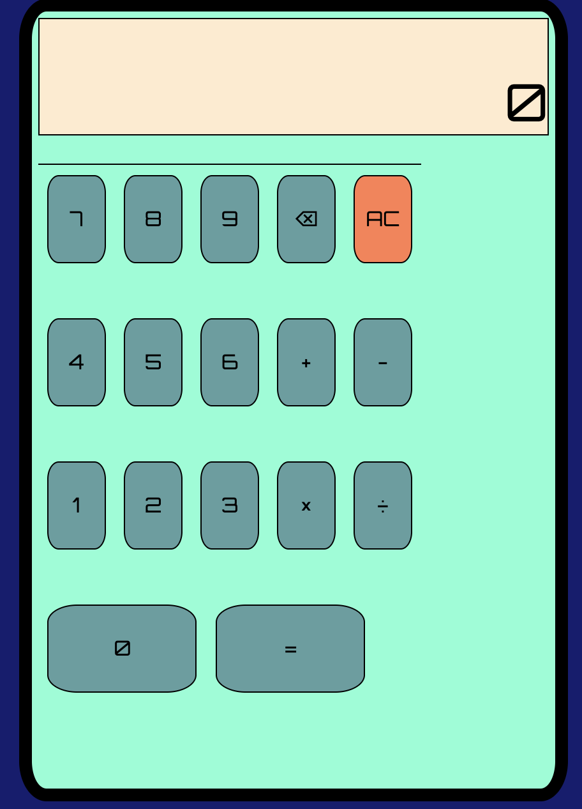

# JavaScript Calculator 🧮


## Overview ✖️

[See the calculator here]()

This is an ongoing project that I will be adding to sporadically. 

After successfully completing General Assembly's Software Engineering Immersive Bootcamp, I was asked to stay on as a teaching assistant for the cohort that followed mine. 

The first two weeks of the course heavily involves the use of CSS Flexbox and 'vanilla' JavaScript logic. 

I decided to build this basic calculator to make sure I was well prepared for the issues that they would be encountering. 


## Technologies Used ➗

- HTML5
- JavaScript
- CSS

## The Approach ✖️

The intention was to use the tools that the students I would be helping would use to refamiliarise myself with the basics that they would encounter. 

The first step was to build a simple calculator using HTML and CSS:

 

In the HTML, there are a number of divs that represent the different parts of the calculator:

```html
<div class="case">
    <div class="display">
      <P class=user-input>0</P>
    </div>
    <div class="break"></div>
    <div class="buttons">
      <div class="button-row top">
        <span id="reset" class="button operator-button">AC</span>
        <span class="button operator-button">⌫</span>
        <span class="button" id="9">9</span>
        <span class="button" id="8">8</span>
        <span class="button" id="7">7</span>
      </div>
```

In the CSS, these are made to be flex containers so that the children within those containers are responsive and adaptable to different screen sizes:

```css
.case{
  display: flex;
  height: 80vh;
  width: 80vw;
  border: solid 10px black;
  border-radius: 5%;
  padding: 1vw;
  flex-direction: column;
  background-color: aquamarine;
  margin-left: 6vw;
}


.buttons {
border-top: solid 1px black;
height: 60vh;
width: 60vw;
display: flex;
flex-wrap: wrap;


}

.button-row{
  display: flex;
  flex-direction: row-reverse;
  width: 60vw;
 
}

```


## Challenges ➖
 


## Successes ➕


## Future features ♾


### [Use the calculator now]()
